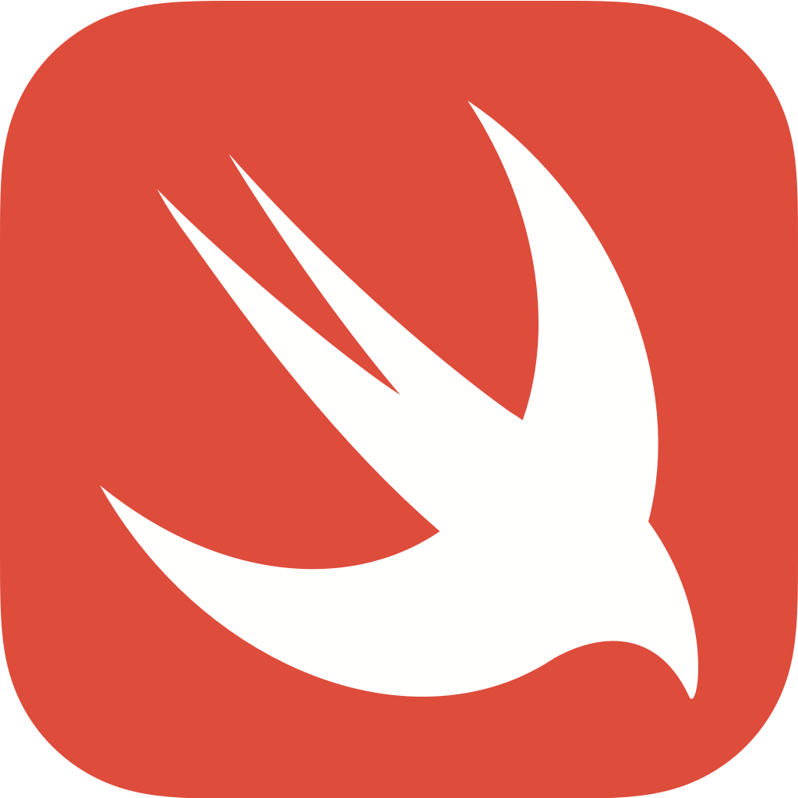

# Swift Playground

This repo contains all of my small apps that I've created while taking iOS apps development course at college and other online non-credit courses like [Stanford University's CS193p (Developing Applications for iOS)](http://web.stanford.edu/class/cs193p/cgi-bin/drupal/).
Playground for experiments and learning.

    

## Projects

### 1. [SpyApp](https://github.com/jkhusanov/Swift-Playground/tree/master/SpyApp) simple the Caesar cipher app. SFSU

### 2. [Concentration](https://github.com/jkhusanov/Swift-Playground/tree/master/Concentration) game, simple memorization game. Stanford

### 3. [OurButton](https://github.com/jkhusanov/swift-playground/tree/master/OurButton) simple delegation example. SFSU

#### Feedback

In case you have any feedback or questions, feel free to open a new issue on this repo or reach out to me [**@jkhusanov**](https://github.com/jkhusanov).
The Swift logo is a trademark of Apple Inc.
